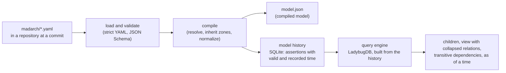

# The graph foundation: format and mechanism

Companion to `change.md`. The example is invented; it shows every part of the
format once.

## The intended model on disk

A repository keeps its model in `madarch/*.yaml`: any number of files, read
together as one model. Strict YAML: no anchors, aliases, merge keys or custom
tags; a duplicate key is an error. Objects span several lines.

```yaml
version: 1

states:                       # optional; without it there is one state, as-is
  - id: as-is
  - id: to-be
    after: as-is

zones:
  - id: pci
    kind: regulatory          # the kind is a free word
  - id: dmz
    kind: network

categories:
  - id: personal
  - id: payment-card

elements:
  - id: shop
    kind: domain
    name: Shop
  - id: checkout-web
    kind: service
    name: Checkout web
    parent: shop
    technology: TypeScript
    evidence:
      - file: services/checkout/README.md
  - id: checkout-cart
    kind: module
    parent: checkout-web
    evidence:
      - file: services/checkout/src/cart/index.ts
        line: 1
  - id: payments
    kind: domain
  - id: payments-api
    kind: service
    parent: payments
    zones:
      add: [pci]              # its parent's zones plus pci
  - id: payments-stub
    kind: service
    parent: payments
    environments: [test]      # exists only in test
  - id: legacy-billing
    kind: service
    parent: payments
    until: to-be              # gone in to-be
  - id: billing-api
    kind: service
    parent: payments
    since: to-be              # appears in to-be

interfaces:
  - id: payments-charge
    provider: payments-api
    contract: http::POST::/api/charges

relations:
  - id: checkout-uses-payments          # a general relation, known at domain level
    from: checkout-web
    to: payments
  - id: checkout-charges-card           # its refinement: the concrete call
    refines: checkout-uses-payments
    from: checkout-cart
    to: payments-api
    interface: payments-charge
    binding:
      env: PAYMENTS_URL
    transfers:
      - direction: forward
        confidentiality: confidential
        categories: [payment-card, personal]
      - direction: reverse
        confidentiality: internal
        categories: []

environments:
  - id: test
    bindings:
      PAYMENTS_URL: http://payments-stub.test.internal
  - id: production
    bindings:
      PAYMENTS_URL: https://payments.prod.internal
    zones:
      payments-api:
        add: [dmz]            # in production it also sits in the DMZ
```

What the reader should notice:

- **Ids are flat and stable.** `checkout-cart` does not say where it lives;
  moving it changes only `parent`. Decision 0014 is followed over 0003's
  namespaced example.
- **A relation at any level.** `checkout-uses-payments` joins a service to a
  domain; `checkout-charges-card` refines it between a module and a service.
  Views count the pair once.
- **A relation with an interface or transfers is an interaction.** It is a node
  with its own id, which flows, decisions and evidence can refer to later.
- **Kinds of element:** person, external, domain, system, service, module,
  store, broker. A cache is a store with its `technology`.
- **Contract ids** are `<kind>::<rest>` with kinds http, grpc, topic, queue,
  data and rpc; path parameters are normalized (`/orders/{id}` becomes
  `/orders/{}`), HTTP methods are upper case.

## From files to answers



- **Model history.** Each element, relation and interface (with its zones,
  presence and binding inside it), and each zone, category, environment and
  state, is one assertion of its source. Storing a new commit of a source
  compares it with what the source asserted before: unchanged assertions stay,
  changed and removed ones are closed, new ones are opened. Valid time is the
  commit's time; recorded time is when it was stored. Nothing is updated in
  place or deleted.
- **Query engine.** LadybugDB holds elements, interactions and relations with
  their four times, built from the history and rebuildable from it at any
  moment. Every traversal filters every hop by the asked time.
- **Runtime boundaries** (0008): `bun:sqlite` and LadybugDB sit behind
  interfaces in adapters; the model, the compiler and the queries' logic use no
  Bun-specific API.

## The walking skeleton

- Bun 1.4.2, pinned in `package.json` (`packageManager`), TypeScript in strict
  mode.
- Dependencies, pinned exactly: `typebox` (one schema source for types, runtime
  validation and the published JSON Schema), `yaml` (strict parsing with
  positions), `@ladybugdb/core` (its install script only copies the prebuilt
  binary for the platform and is listed as trusted).
- Commands: `bun run check` (type check), `bun test`.
- CI: a GitHub Actions workflow on push and pull request running install,
  check and test on Linux.

## Readings decided during the run

Stage 1's review turned up questions the requirements answer only in spirit.
The run decided them as follows; each is a reading of an approved requirement,
not a new one.

- **Presence is inherited.** An element exists in an environment and a state
  only where its parent does, narrowed by its own `environments`, `since` and
  `until`. A relation exists where both its ends exist, narrowed by its own
  `since`/`until`; a refinement only where the relation it refines exists. An
  element or relation left existing nowhere is refused, as is an element that
  names an environment its parent is absent from, and `environments: []`.
- **No environments declared.** Compiled presence then says `"*"` (every
  environment) rather than an empty list, which would read as "none"; the
  compiled schema documents it. `"*"` cannot collide with an id.
- **Zones per environment.** An environment's zone change is checked like an
  element's own and is inherited by descendants; changing the zones of an
  element absent from the environment is refused. `zonesByEnvironment` lists
  only the environments an element exists in.
- **Strict YAML refuses every explicit tag**, core ones such as `!!str`
  included: the simpler strict reading of "custom tags".
- **Files.** Only `*.yaml` is read; a `*.yml` file in `madarch/` is an error
  naming it, and an empty or missing folder is "no model". Filesystem failures
  are errors, never exceptions. `parseModel(files)` is the pure core; the folder
  loader is a thin adapter over it, so stage 2 can read files from git.
- **Contracts.** An HTTP contract's method is one of GET, HEAD, POST, PUT,
  PATCH, DELETE, OPTIONS, TRACE, CONNECT (any case before normalization) and its
  path starts with `/`.
- **Values.** Evidence `line` is an integer from 1; `confidentiality` and a
  zone's `kind` are non-empty; an unknown `version` is refused.
- **Bytes.** `serializeCompiledModel` writes model.json's exact text; every
  object is rebuilt in a fixed key order and every sort compares code points,
  never the locale.
- **Relations carry `bindingByEnvironment`**: the bound variable's value in
  each environment where the relation exists; an environment that leaves it
  unset has no entry (not an error).
- **Not enforced, on purpose:** an interface's provider need not be the
  relation's `to` end; two interfaces may share a contract; a secret value
  written into `bindings` is published as written, so authors keep secrets out.
- **What an assertion is.** An element, an interface or a relation is one
  assertion with its zone changes, presence and binding inside it; so are each
  zone, category, environment and state. Closing an assertion sets its recorded
  end: the one field ever written after insertion. Content and valid times never
  change, and nothing is deleted.
- **A late commit.** A commit older than one already stored is placed by its
  commit time: it closes what it changes only up to the next stored commit, and
  what that next commit asserted stays as it was. Commits of one source with the
  same time are ordered by commit id.
- **Sources share declarations, not parts** (the owner's decision,
  2026-09-24). Elements, interfaces and relations belong to one source; another
  source declaring the same id over an overlapping valid time is refused. Zones,
  categories, environments and states may be declared by several sources and
  nothing about them is refused: identical definitions merge; where sources
  define one differently, the union read keeps every source's definition
  (`alsoDefinedAs`) and returns a list of discrepancies beside the model. An
  environment's bindings belong to their source (`bindingsBySource` in the
  union): two repositories binding one variable to different endpoints are two
  facts, and each relation carries its own source's value. A disagreement on
  the order of states is a discrepancy too. The letter of model-history/sources
  refuses any repeated id; since every source must declare the zones,
  environments and states it refers to, the run reads it as applying to
  elements, interfaces and relations.
- **Repeats.** Storing a stored commit again with the same time and model
  changes nothing; with a different time or model it is refused.
- **The default state.** A query without a state uses the first state of the
  chain when every source agrees on the chain (identical declarations from
  several sources agree). When they disagree, a query without a state is an
  error naming the states it could use; with a state it works.
- **Refinements in a view.** A refinement is drawn only when both of its own
  ends are shown in the view, or when the relation it refines is not drawn;
  otherwise it is counted once under its general relation. Drilling in
  therefore shows the detailed relation, and the approved scenario
  refinement-counted-once holds.
- **Scope and depth.** A scoped view shows the scope and its descendants down
  to the depth, and only relations with both ends among them; external
  neighbours are left to the views of outcome 2. Depth means the same with and
  without a scope: depth 0 is the scope (or the roots) alone.
- **Chains.** Dependents and dependencies come with one shortest chain each
  (not a fixed choice among equal ones), filtered by
  time and state on every hop; an element is never its own dependent.
- **Two ways to keep the engine in step.** `rebuild()` builds it from the
  whole history; `update()` applies one store's report. Both keep both time
  axes and give the same answers.
