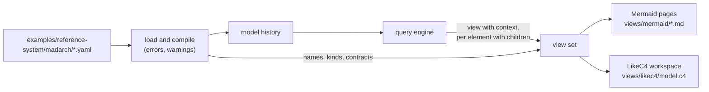

# Readable views: mechanism

## The renderer's input

One function builds the **view set** from a query engine and the compiled
model at one time and state: the landscape (`view({ depth: 0 })`, the elements
with no parent) and, for
every element with children, `view({ scope, depth: 1, context: true })`. Each
view in the set holds its shown elements (kind, name, whether inside the scope
or a neighbour), its arrows (the shown pair and the relation ids behind it)
and each arrow's label, worked out from the compiled model: names in id order,
the first three and "+N more"; an unnamed relation falls back to its
interface's contract, then its id. Mermaid and LikeC4 each turn the same view
set into text; neither queries anything itself. The server of outcome 4 calls
the same function for a view on request.

## Mermaid

One page per view: a heading, one `flowchart LR` block, then links. The scope
is a `subgraph` frame around its children; neighbours sit outside it. Node ids
are the element ids made safe for Mermaid (every character outside letters,
digits and `_` replaced), and labels are quoted with Mermaid's entity codes
for quotes. Shapes: persons `([ ])`, stores `[( )]`, brokers `[[ ]]`, others
`[ ]`; externals get a `classDef` of their own. Under the diagram: "Up" to the
parent's page (or the landscape) and "Open" for each shown element with a
view. File names are the element ids, the landscape `_landscape.md` (an id
starts with a letter or digit, so no element page can take that name).

## LikeC4

One file: a `specification` with one element kind per madarch kind (shapes:
person, storage, queue), the `model` with elements nested under their parents
(LikeC4 identifiers are the ids with characters outside its identifier rules
replaced, kept unique), every relation between its own ends with its label,
and `views`: `index` of the whole model and one `view <id> of <element>` per
element with children with `include *`. LikeC4 collapses and navigates by
itself; it is a view, not the truth (0001), so a refinement drawn beside its
general relation there is accepted.

## Checks

- `bun run views` renders `examples/reference-system` into its `views/`
  folder; a test renders it again in memory and compares every byte.
- `bun run views:check` parses every Mermaid block of the committed pages with
  `mermaid.parse` under a happy-dom global, and runs `likec4 validate` on the
  workspace; it fails naming the page or file and the error. CI runs it after
  the tests.

## Decided during the run

- **Blank names are no names** (madarch-mk5.1.1): an empty or space-only
  `name` is warned about like a missing one and left out of the compiled
  model, so no label comes out blank.
- **Warnings on a refused model** are still returned for every file that read
  and matched the schema, so an author fixes everything in one pass.
- **The compiled schema stays at version 1** although it now carries an
  optional relation name: a reader validating new output against the old
  strict schema would refuse it, but no v1 reader outside this repository
  exists yet; the first published release fixes the version.
- **The landscape is `view({ depth: 0 })`**: unscoped depth 0 is exactly the
  elements with no parent (madarch-mk5.2.2).
- **Repeated names in a merged label are shown once**, the first in
  relation-id order; "+N more" counts distinct labels. The requirement's
  "names in id order" is read this way.
- **A view knows its way up**: the view set carries the scope's parent, which
  is usually not drawn in its child's view, for the "Up" link.
- **The reference system is rendered at 2026-09-25T00:00:00Z**, used as its
  version's commit and store time and as the valid and known time asked.
- **Two ids differing only by letter case are refused** when rendering pages:
  their files would overwrite each other on a case-insensitive file system.
- **The Mermaid check lives in `scripts/`** as tooling, finds pages in
  subfolders, reports the line of each failing block's fence, and fails on a
  folder without pages or a page without a block.
- **The view set finds the elements with children from one unscoped view**
  deep enough to hold every element, not one children query per element; an
  element whose parent is absent at the asked time is an error.
- **The engine's view keeps lifting in Cypher and decides refinements in
  TypeScript**: its relation query returns one row per drawable relation (the
  lifted pair, what it refines, whether its own ends are shown), and the
  engine drops a refinement whose general relation is drawn, then merges. The
  three optional matches that did this in the query cost about 15 ms per view
  whether or not anything was refined. A 990-element model now renders its
  501 pages in about 5 s (13.7 s before).
- **Deep nesting stays slow and is recorded as a coverage limit**: a chain of
  1 000 nested elements takes about 69 s, because every lift filters ancestor
  lists as long as the depth; lifting by position would allow parameters and
  one prepared statement, an engine redesign no real model needs now.
