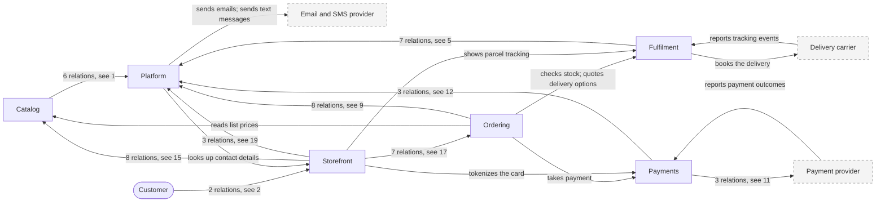

# Landscape

| # | From | To | Relations |
| --- | --- | --- | --- |
| 1 | Catalog | Platform | publishes price-changed; publishes product-changed; learns from placed orders; reindexes changed prices; reindexes changed products; updates availability in the index |
| 2 | Customer | Storefront | browses and buys in the app; browses and buys on the web |
| 3 | Delivery carrier | Fulfilment | reports tracking events |
| 4 | Fulfilment | Delivery carrier | books the delivery |
| 5 | Fulfilment | Platform | publishes stock-changed; releases stock of cancelled orders; reserves stock for placed orders; publishes shipment-dispatched; ships packed parcels; creates pick lists for confirmed orders; publishes parcel-packed |
| 6 | Ordering | Catalog | reads list prices |
| 7 | Ordering | Fulfilment | checks stock; quotes delivery options |
| 8 | Ordering | Payments | takes payment |
| 9 | Ordering | Platform | issues invoices for confirmed orders; cancels unpaid orders; confirms paid orders; marks orders as shipped; publishes order-cancelled; publishes order-confirmed; publishes order-placed; publishes return-approved |
| 10 | Payment provider | Payments | reports payment outcomes |
| 11 | Payments | Payment provider | charges the card; refunds the payment; downloads settlement reports |
| 12 | Payments | Platform | publishes payment-captured; publishes payment-failed; refunds approved returns |
| 13 | Platform | Email and SMS provider | sends emails; sends text messages |
| 14 | Platform | Storefront | looks up contact details |
| 15 | Storefront | Catalog | searches products; shows product pages; loads product images; posts a review; shows recommendations; shows reviews |
| 16 | Storefront | Fulfilment | shows parcel tracking |
| 17 | Storefront | Ordering | checks out the cart; adds items to the cart; downloads an invoice; requests a return; shows the order history |
| 18 | Storefront | Payments | tokenizes the card |
| 19 | Storefront | Platform | awards points for placed orders; signs the customer in |

Open: [Catalog](catalog.md) · [Fulfilment](fulfilment.md) · [Ordering](ordering.md) · [Payments](payments.md) · [Platform](platform.md) · [Storefront](storefront.md)
