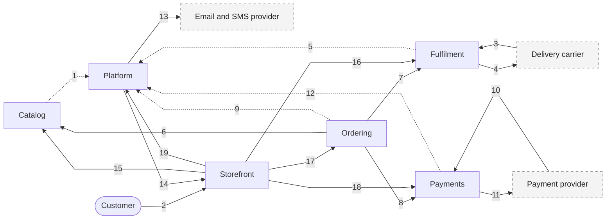

# Landscape

```mermaid
%%{init: {"flowchart": {"curve": "linear"}}}%%
flowchart LR
  catalog["Catalog"]
  customer(["Customer"])
  delivery_carrier["Delivery carrier"]
  fulfilment["Fulfilment"]
  messaging_provider["Email and SMS provider"]
  ordering["Ordering"]
  payment_provider["Payment provider"]
  payments["Payments"]
  platform["Platform"]
  storefront["Storefront"]
  catalog -.->|"1"| platform
  customer -->|"2"| storefront
  delivery_carrier -->|"3"| fulfilment
  fulfilment -->|"4"| delivery_carrier
  fulfilment -.->|"5"| platform
  ordering -->|"6"| catalog
  ordering -->|"7"| fulfilment
  ordering -->|"8"| payments
  ordering -.->|"9"| platform
  payment_provider -->|"10"| payments
  payments -->|"11"| payment_provider
  payments -.->|"12"| platform
  platform -->|"13"| messaging_provider
  platform -->|"14"| storefront
  storefront -->|"15"| catalog
  storefront -->|"16"| fulfilment
  storefront -->|"17"| ordering
  storefront -->|"18"| payments
  storefront -->|"19"| platform
  classDef external fill:#f4f4f4,stroke:#888888,stroke-dasharray:5 5,color:#222222
  class delivery_carrier,messaging_provider,payment_provider external
```

| # | From | To | Relations |
| --- | --- | --- | --- |
| 1 | Catalog | Platform | publishes price-changed; publishes product-changed; subscribes to order-placed: learns from placed orders; subscribes to price-changed: reindexes changed prices; subscribes to product-changed: reindexes changed products; subscribes to stock-changed: updates availability in the index |
| 2 | Customer | Storefront | browses and buys in the app; browses and buys on the web |
| 3 | Delivery carrier | Fulfilment | reports tracking events |
| 4 | Fulfilment | Delivery carrier | books the delivery |
| 5 | Fulfilment | Platform | publishes stock-changed; subscribes to order-cancelled: releases stock of cancelled orders; subscribes to order-placed: reserves stock for placed orders; publishes shipment-dispatched; subscribes to parcel-packed: ships packed parcels; subscribes to order-confirmed: creates pick lists for confirmed orders; publishes parcel-packed |
| 6 | Ordering | Catalog | reads list prices |
| 7 | Ordering | Fulfilment | checks stock; quotes delivery options |
| 8 | Ordering | Payments | takes payment |
| 9 | Ordering | Platform | subscribes to order-confirmed: issues invoices for confirmed orders; subscribes to payment-failed: cancels unpaid orders; subscribes to payment-captured: confirms paid orders; subscribes to shipment-dispatched: marks orders as shipped; publishes order-cancelled; publishes order-confirmed; publishes order-placed; publishes return-approved |
| 10 | Payment provider | Payments | reports payment outcomes |
| 11 | Payments | Payment provider | charges the card; refunds the payment; downloads settlement reports |
| 12 | Payments | Platform | publishes payment-captured; publishes payment-failed; subscribes to return-approved: refunds approved returns |
| 13 | Platform | Email and SMS provider | sends emails; sends text messages |
| 14 | Platform | Storefront | looks up contact details |
| 15 | Storefront | Catalog | searches products; shows product pages; loads product images; posts a review; searches products; shows product pages; shows recommendations; shows reviews |
| 16 | Storefront | Fulfilment | shows parcel tracking |
| 17 | Storefront | Ordering | checks out the cart; adds items to the cart; checks out the cart; downloads an invoice; adds items to the cart; requests a return; shows the order history |
| 18 | Storefront | Payments | tokenizes the card; tokenizes the card |
| 19 | Storefront | Platform | subscribes to order-placed: awards points for placed orders; signs the customer in; signs the customer in |

Open: [Catalog](catalog.md) · [Fulfilment](fulfilment.md) · [Ordering](ordering.md) · [Payments](payments.md) · [Platform](platform.md) · [Storefront](storefront.md)
