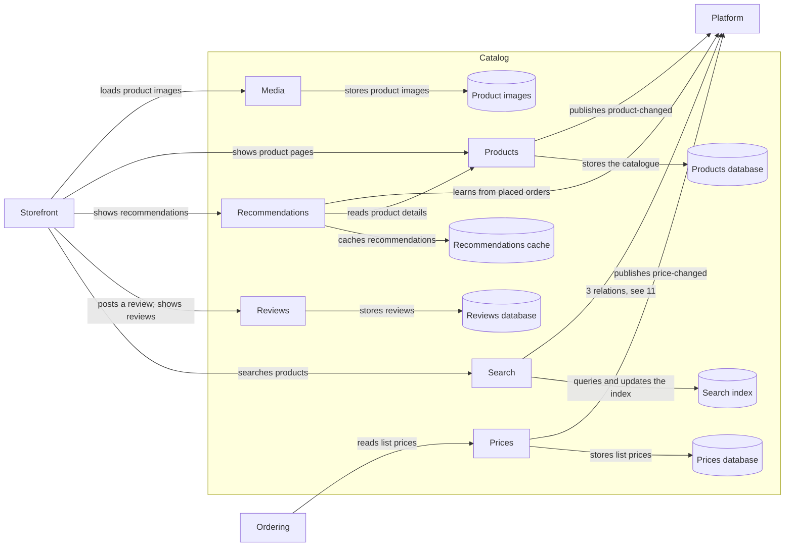

# Catalog (domain)

| # | From | To | Relations |
| --- | --- | --- | --- |
| 1 | Media | Product images | stores product images |
| 2 | Ordering | Prices | reads list prices |
| 3 | Prices | Platform | publishes price-changed |
| 4 | Prices | Prices database | stores list prices |
| 5 | Products | Platform | publishes product-changed |
| 6 | Products | Products database | stores the catalogue |
| 7 | Recommendations | Platform | learns from placed orders |
| 8 | Recommendations | Products | reads product details |
| 9 | Recommendations | Recommendations cache | caches recommendations |
| 10 | Reviews | Reviews database | stores reviews |
| 11 | Search | Platform | reindexes changed prices; reindexes changed products; updates availability in the index |
| 12 | Search | Search index | queries and updates the index |
| 13 | Storefront | Media | loads product images |
| 14 | Storefront | Products | shows product pages |
| 15 | Storefront | Recommendations | shows recommendations |
| 16 | Storefront | Reviews | posts a review; shows reviews |
| 17 | Storefront | Search | searches products |

Up: [Landscape](_landscape.md)

Open: [Ordering](ordering.md) · [Platform](platform.md) · [Storefront](storefront.md)
