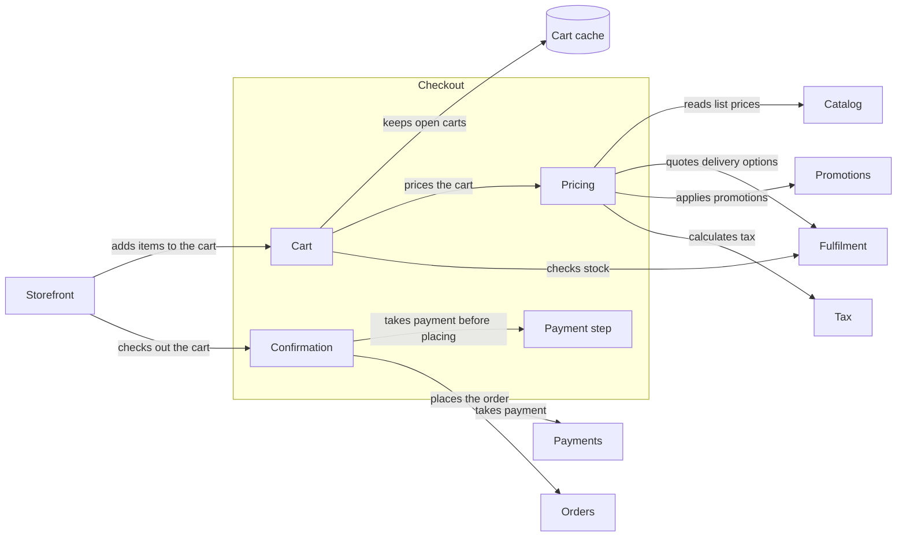

# Checkout (service)

```mermaid
flowchart LR
  subgraph checkout_api ["Checkout"]
    checkout_cart["Cart"]
    checkout_confirmation["Confirmation"]
    checkout_payment_step["Payment step"]
    checkout_pricing["Pricing"]
  end
  cart_cache[("Cart cache")]
  catalog["Catalog"]
  fulfilment["Fulfilment"]
  orders_api["Orders"]
  payments["Payments"]
  promotions_api["Promotions"]
  storefront["Storefront"]
  tax_api["Tax"]
  checkout_api -->|"takes payment"| payments
  checkout_cart -->|"keeps open carts"| cart_cache
  checkout_cart -->|"prices the cart"| checkout_pricing
  checkout_cart -->|"checks stock"| fulfilment
  checkout_confirmation -->|"takes payment before placing"| checkout_payment_step
  checkout_confirmation -->|"places the order"| orders_api
  checkout_pricing -->|"reads list prices"| catalog
  checkout_pricing -->|"quotes delivery options"| fulfilment
  checkout_pricing -->|"applies promotions"| promotions_api
  checkout_pricing -->|"calculates tax"| tax_api
  storefront -->|"adds items to the cart"| checkout_cart
  storefront -->|"checks out the cart"| checkout_confirmation
```

Up: [Ordering](ordering.md)

Open: [Catalog](catalog.md) · [Fulfilment](fulfilment.md) · [Payments](payments.md) · [Storefront](storefront.md)
