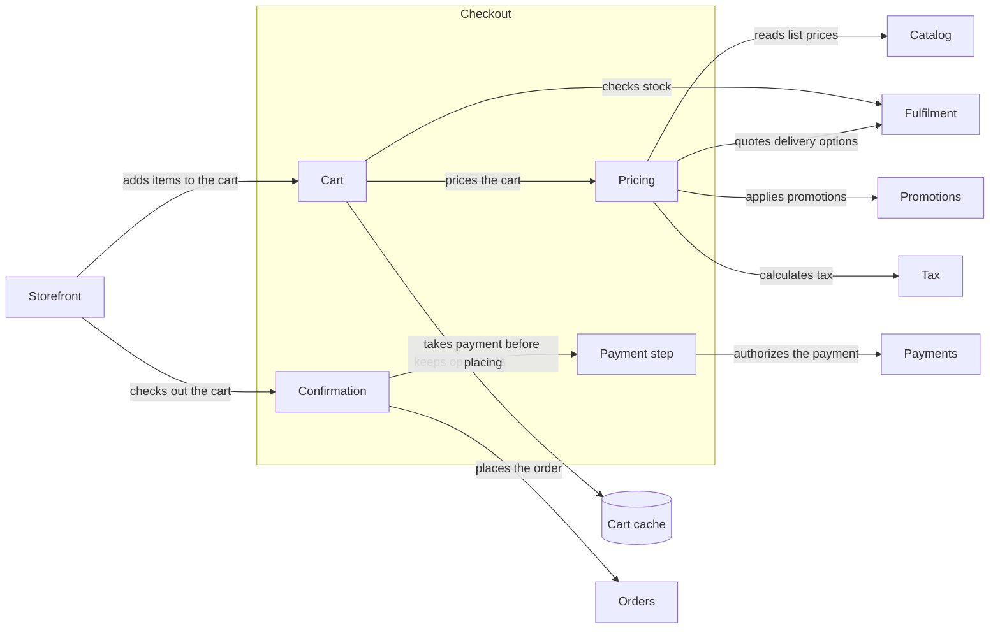

# Checkout (service)

| # | From | To | Relations |
| --- | --- | --- | --- |
| 1 | Cart | Cart cache | keeps open carts |
| 2 | Cart | Pricing | prices the cart |
| 3 | Cart | Fulfilment | checks stock |
| 4 | Confirmation | Payment step | takes payment before placing |
| 5 | Confirmation | Orders | places the order |
| 6 | Payment step | Payments | authorizes the payment |
| 7 | Pricing | Catalog | reads list prices |
| 8 | Pricing | Fulfilment | quotes delivery options |
| 9 | Pricing | Promotions | applies promotions |
| 10 | Pricing | Tax | calculates tax |
| 11 | Storefront | Cart | adds items to the cart |
| 12 | Storefront | Confirmation | checks out the cart |

Up: [Ordering](ordering.md)

Open: [Catalog](catalog.md) · [Fulfilment](fulfilment.md) · [Payments](payments.md) · [Storefront](storefront.md)
