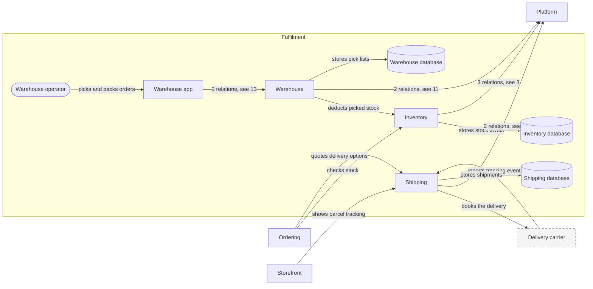

# Fulfilment (domain)

| # | From | To | Relations |
| --- | --- | --- | --- |
| 1 | Delivery carrier | Shipping | reports tracking events |
| 2 | Inventory | Inventory database | stores stock levels |
| 3 | Inventory | Platform | publishes stock-changed; releases stock of cancelled orders; reserves stock for placed orders |
| 4 | Ordering | Inventory | checks stock |
| 5 | Ordering | Shipping | quotes delivery options |
| 6 | Shipping | Delivery carrier | books the delivery |
| 7 | Shipping | Platform | publishes shipment-dispatched; ships packed parcels |
| 8 | Shipping | Shipping database | stores shipments |
| 9 | Storefront | Shipping | shows parcel tracking |
| 10 | Warehouse | Inventory | deducts picked stock |
| 11 | Warehouse | Platform | creates pick lists for confirmed orders; publishes parcel-packed |
| 12 | Warehouse | Warehouse database | stores pick lists |
| 13 | Warehouse app | Warehouse | confirms packed parcels; loads pick lists |
| 14 | Warehouse operator | Warehouse app | picks and packs orders |

Up: [Landscape](_landscape.md)

Open: [Ordering](ordering.md) · [Platform](platform.md) · [Storefront](storefront.md)
