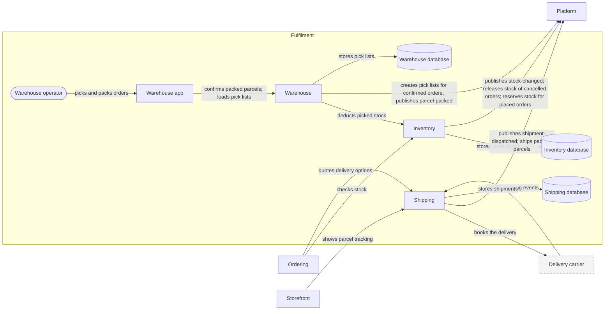

# Fulfilment (domain)

```mermaid
flowchart LR
  subgraph fulfilment ["Fulfilment"]
    inventory_api["Inventory"]
    inventory_db[("Inventory database")]
    shipping_api["Shipping"]
    shipping_db[("Shipping database")]
    warehouse_api["Warehouse"]
    warehouse_app["Warehouse app"]
    warehouse_db[("Warehouse database")]
    warehouse_operator(["Warehouse operator"])
  end
  delivery_carrier["Delivery carrier"]
  ordering["Ordering"]
  platform["Platform"]
  storefront["Storefront"]
  delivery_carrier -->|"reports tracking events"| shipping_api
  inventory_api -->|"stores stock levels"| inventory_db
  inventory_api -->|"publishes stock-changed; releases stock of cancelled orders; reserves stock for placed orders"| platform
  ordering -->|"checks stock"| inventory_api
  ordering -->|"quotes delivery options"| shipping_api
  shipping_api -->|"books the delivery"| delivery_carrier
  shipping_api -->|"publishes shipment-dispatched; ships packed parcels"| platform
  shipping_api -->|"stores shipments"| shipping_db
  storefront -->|"shows parcel tracking"| shipping_api
  warehouse_api -->|"deducts picked stock"| inventory_api
  warehouse_api -->|"creates pick lists for confirmed orders; publishes parcel-packed"| platform
  warehouse_api -->|"stores pick lists"| warehouse_db
  warehouse_app -->|"confirms packed parcels; loads pick lists"| warehouse_api
  warehouse_operator -->|"picks and packs orders"| warehouse_app
  classDef external fill:#f4f4f4,stroke:#888888,stroke-dasharray:5 5
  class delivery_carrier external
```

Up: [Landscape](_landscape.md)

Open: [Ordering](ordering.md) · [Platform](platform.md) · [Storefront](storefront.md)
