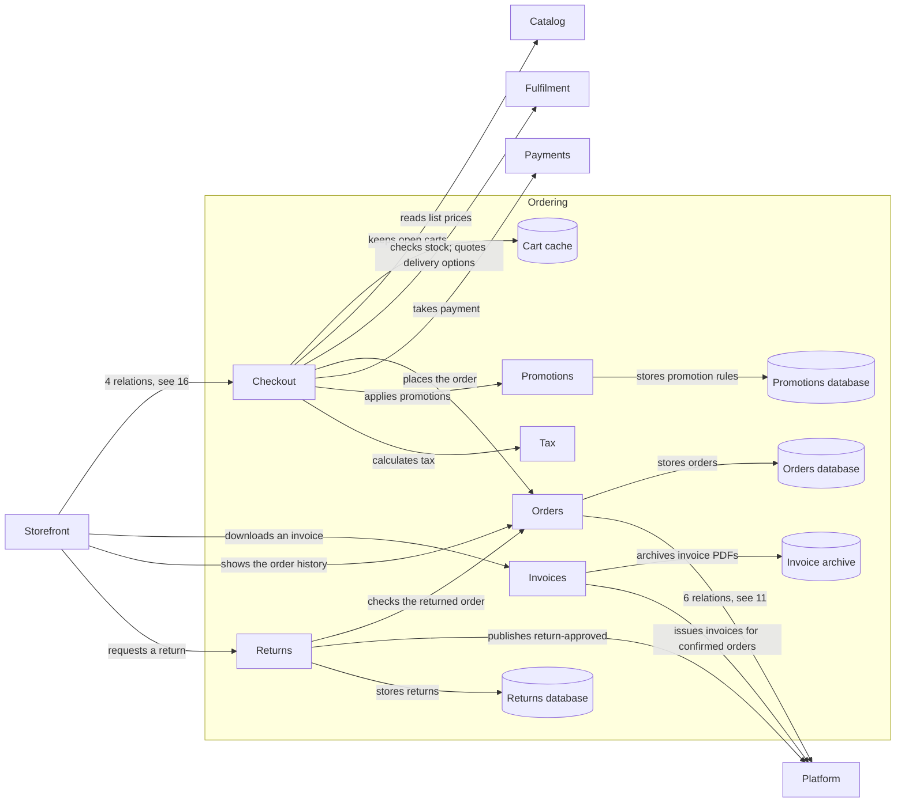

# Ordering (domain)

| # | From | To | Relations |
| --- | --- | --- | --- |
| 1 | Checkout | Cart cache | keeps open carts |
| 2 | Checkout | Catalog | reads list prices |
| 3 | Checkout | Fulfilment | checks stock; quotes delivery options |
| 4 | Checkout | Orders | places the order |
| 5 | Checkout | Payments | takes payment |
| 6 | Checkout | Promotions | applies promotions |
| 7 | Checkout | Tax | calculates tax |
| 8 | Invoices | Invoice archive | archives invoice PDFs |
| 9 | Invoices | Platform | issues invoices for confirmed orders |
| 10 | Orders | Orders database | stores orders |
| 11 | Orders | Platform | cancels unpaid orders; confirms paid orders; marks orders as shipped; publishes order-cancelled; publishes order-confirmed; publishes order-placed |
| 12 | Promotions | Promotions database | stores promotion rules |
| 13 | Returns | Orders | checks the returned order |
| 14 | Returns | Platform | publishes return-approved |
| 15 | Returns | Returns database | stores returns |
| 16 | Storefront | Checkout | checks out the cart; adds items to the cart |
| 17 | Storefront | Invoices | downloads an invoice |
| 18 | Storefront | Orders | shows the order history |
| 19 | Storefront | Returns | requests a return |

Up: [Landscape](_landscape.md)

Open: [Catalog](catalog.md) · [Checkout](checkout-api.md) · [Fulfilment](fulfilment.md) · [Payments](payments.md) · [Platform](platform.md) · [Storefront](storefront.md)
