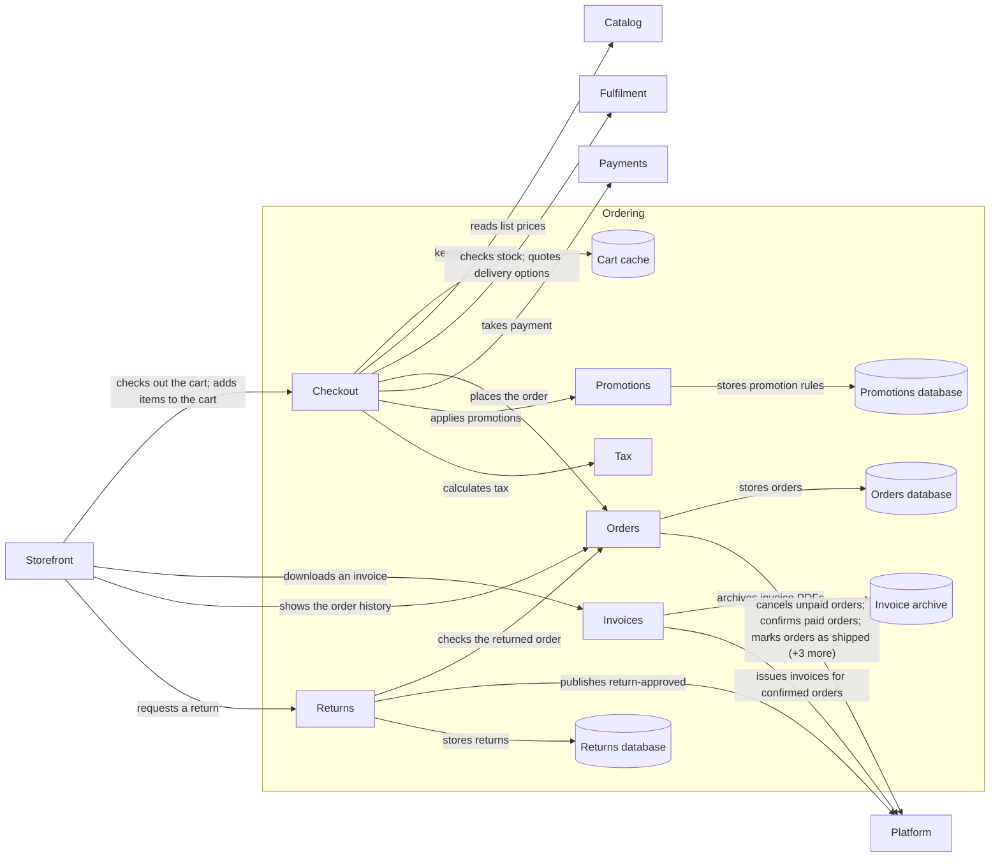

# Ordering (domain)

Up: [Landscape](_landscape.md)

Open: [Catalog](catalog.md) · [Checkout](checkout-api.md) · [Fulfilment](fulfilment.md) · [Payments](payments.md) · [Platform](platform.md) · [Storefront](storefront.md)
