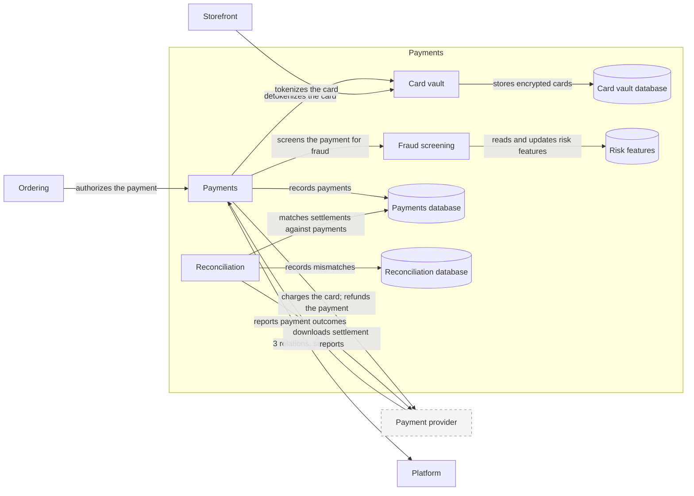

# Payments (domain)

| # | From | To | Relations |
| --- | --- | --- | --- |
| 1 | Card vault | Card vault database | stores encrypted cards |
| 2 | Fraud screening | Risk features | reads and updates risk features |
| 3 | Ordering | Payments | authorizes the payment |
| 4 | Payment provider | Payments | reports payment outcomes |
| 5 | Payments | Card vault | detokenizes the card |
| 6 | Payments | Fraud screening | screens the payment for fraud |
| 7 | Payments | Payment provider | charges the card; refunds the payment |
| 8 | Payments | Payments database | records payments |
| 9 | Payments | Platform | publishes payment-captured; publishes payment-failed; refunds approved returns |
| 10 | Reconciliation | Payment provider | downloads settlement reports |
| 11 | Reconciliation | Payments database | matches settlements against payments |
| 12 | Reconciliation | Reconciliation database | records mismatches |
| 13 | Storefront | Card vault | tokenizes the card |

Up: [Landscape](_landscape.md)

Open: [Ordering](ordering.md) · [Platform](platform.md) · [Storefront](storefront.md)
