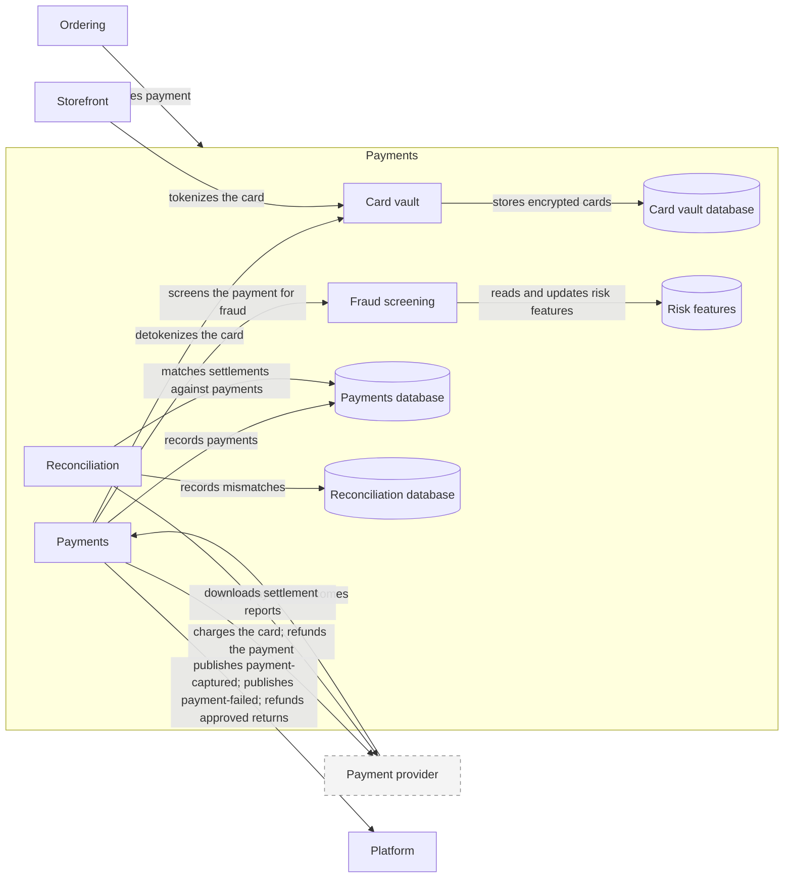

# Payments (domain)

```mermaid
flowchart LR
  subgraph payments ["Payments"]
    card_vault["Card vault"]
    card_vault_db[("Card vault database")]
    fraud_api["Fraud screening"]
    fraud_features[("Risk features")]
    payments_api["Payments"]
    payments_db[("Payments database")]
    reconciliation_db[("Reconciliation database")]
    reconciliation_job["Reconciliation"]
  end
  ordering["Ordering"]
  payment_provider["Payment provider"]
  platform["Platform"]
  storefront["Storefront"]
  card_vault -->|"stores encrypted cards"| card_vault_db
  fraud_api -->|"reads and updates risk features"| fraud_features
  ordering -->|"takes payment"| payments
  payment_provider -->|"reports payment outcomes"| payments_api
  payments_api -->|"detokenizes the card"| card_vault
  payments_api -->|"screens the payment for fraud"| fraud_api
  payments_api -->|"charges the card; refunds the payment"| payment_provider
  payments_api -->|"records payments"| payments_db
  payments_api -->|"publishes payment-captured; publishes payment-failed; refunds approved returns"| platform
  reconciliation_job -->|"downloads settlement reports"| payment_provider
  reconciliation_job -->|"matches settlements against payments"| payments_db
  reconciliation_job -->|"records mismatches"| reconciliation_db
  storefront -->|"tokenizes the card"| card_vault
  classDef external fill:#f4f4f4,stroke:#888888,stroke-dasharray:5 5
  class payment_provider external
```

Up: [Landscape](index.md)

Open: [Ordering](ordering.md) · [Platform](platform.md) · [Storefront](storefront.md)
