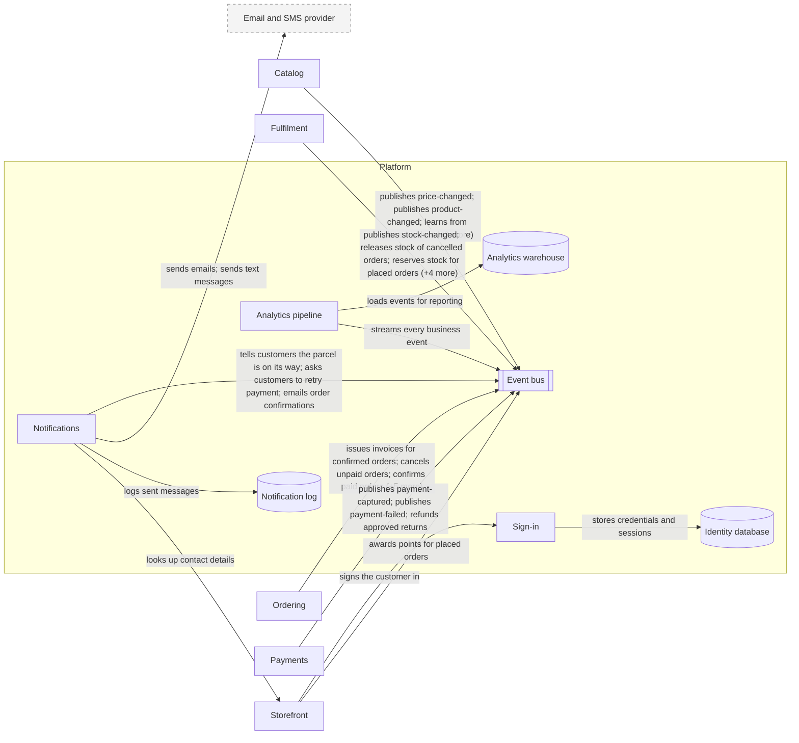

# Platform (domain)

```mermaid
flowchart LR
  subgraph platform ["Platform"]
    analytics_pipeline["Analytics pipeline"]
    analytics_warehouse[("Analytics warehouse")]
    auth_api["Sign-in"]
    auth_db[("Identity database")]
    event_bus[["Event bus"]]
    notification_api["Notifications"]
    notification_db[("Notification log")]
  end
  catalog["Catalog"]
  fulfilment["Fulfilment"]
  messaging_provider["Email and SMS provider"]
  ordering["Ordering"]
  payments["Payments"]
  storefront["Storefront"]
  analytics_pipeline -->|"loads events for reporting"| analytics_warehouse
  analytics_pipeline -->|"streams every business event"| event_bus
  auth_api -->|"stores credentials and sessions"| auth_db
  catalog -->|"publishes price-changed; publishes product-changed; learns from placed orders (+3 more)"| event_bus
  fulfilment -->|"publishes stock-changed; releases stock of cancelled orders; reserves stock for placed orders (+4 more)"| event_bus
  notification_api -->|"tells customers the parcel is on its way; asks customers to retry payment; emails order confirmations"| event_bus
  notification_api -->|"sends emails; sends text messages"| messaging_provider
  notification_api -->|"logs sent messages"| notification_db
  notification_api -->|"looks up contact details"| storefront
  ordering -->|"issues invoices for confirmed orders; cancels unpaid orders; confirms paid orders (+5 more)"| event_bus
  payments -->|"publishes payment-captured; publishes payment-failed; refunds approved returns"| event_bus
  storefront -->|"signs the customer in"| auth_api
  storefront -->|"awards points for placed orders"| event_bus
  classDef external fill:#f4f4f4,stroke:#888888,stroke-dasharray:5 5
  class messaging_provider external
```

Up: [Landscape](index.md)

Open: [Catalog](catalog.md) · [Fulfilment](fulfilment.md) · [Ordering](ordering.md) · [Payments](payments.md) · [Storefront](storefront.md)
