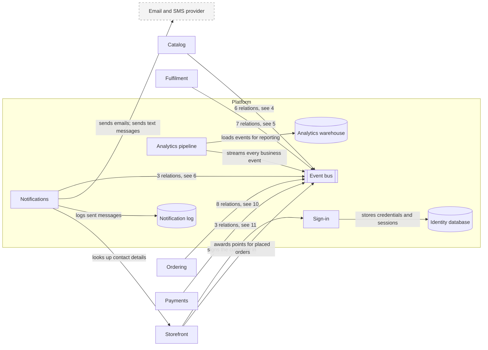

# Platform (domain)

| # | From | To | Relations |
| --- | --- | --- | --- |
| 1 | Analytics pipeline | Analytics warehouse | loads events for reporting |
| 2 | Analytics pipeline | Event bus | streams every business event |
| 3 | Sign-in | Identity database | stores credentials and sessions |
| 4 | Catalog | Event bus | publishes price-changed; publishes product-changed; learns from placed orders; reindexes changed prices; reindexes changed products; updates availability in the index |
| 5 | Fulfilment | Event bus | publishes stock-changed; releases stock of cancelled orders; reserves stock for placed orders; publishes shipment-dispatched; ships packed parcels; creates pick lists for confirmed orders; publishes parcel-packed |
| 6 | Notifications | Event bus | tells customers the parcel is on its way; asks customers to retry payment; emails order confirmations |
| 7 | Notifications | Email and SMS provider | sends emails; sends text messages |
| 8 | Notifications | Notification log | logs sent messages |
| 9 | Notifications | Storefront | looks up contact details |
| 10 | Ordering | Event bus | issues invoices for confirmed orders; cancels unpaid orders; confirms paid orders; marks orders as shipped; publishes order-cancelled; publishes order-confirmed; publishes order-placed; publishes return-approved |
| 11 | Payments | Event bus | publishes payment-captured; publishes payment-failed; refunds approved returns |
| 12 | Storefront | Sign-in | signs the customer in |
| 13 | Storefront | Event bus | awards points for placed orders |

Up: [Landscape](_landscape.md)

Open: [Catalog](catalog.md) · [Fulfilment](fulfilment.md) · [Ordering](ordering.md) · [Payments](payments.md) · [Storefront](storefront.md)
