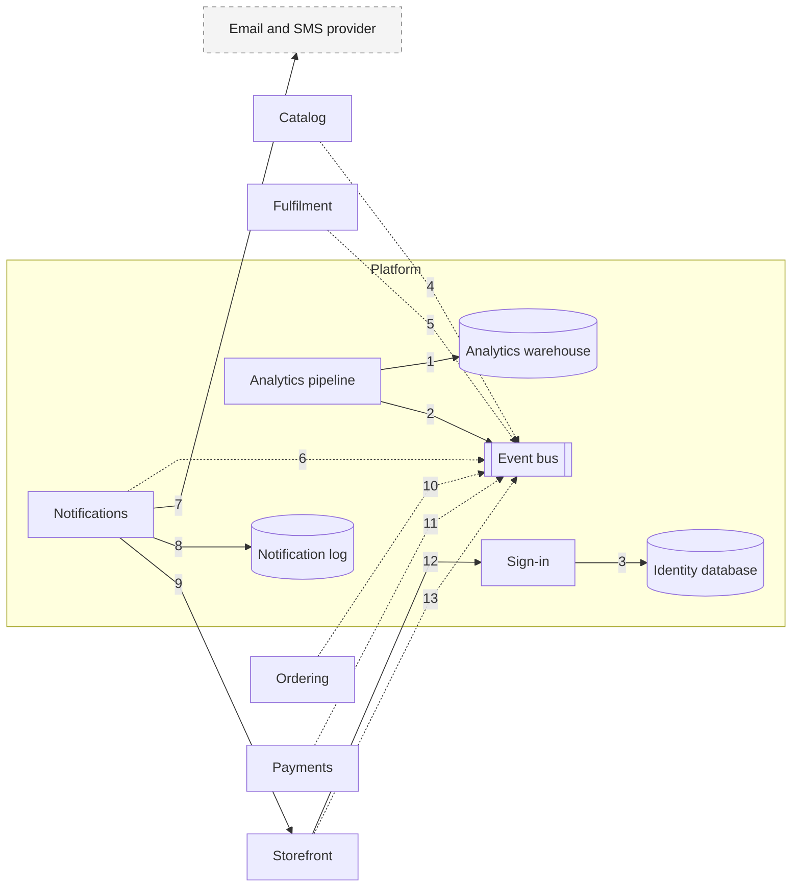

# Platform (domain)

```mermaid
%%{init: {"flowchart": {"curve": "linear"}}}%%
flowchart LR
  subgraph platform ["Platform"]
    analytics_pipeline["Analytics pipeline"]
    analytics_warehouse[("Analytics warehouse")]
    auth_api["Sign-in"]
    auth_db[("Identity database")]
    event_bus[["Event bus"]]
    notification_api["Notifications"]
    notification_db[("Notification log")]
  end
  catalog["Catalog"]
  fulfilment["Fulfilment"]
  messaging_provider["Email and SMS provider"]
  ordering["Ordering"]
  payments["Payments"]
  storefront["Storefront"]
  analytics_pipeline -->|"1"| analytics_warehouse
  analytics_pipeline -->|"2"| event_bus
  auth_api -->|"3"| auth_db
  catalog -.->|"4"| event_bus
  fulfilment -.->|"5"| event_bus
  notification_api -.->|"6"| event_bus
  notification_api -->|"7"| messaging_provider
  notification_api -->|"8"| notification_db
  notification_api -->|"9"| storefront
  ordering -.->|"10"| event_bus
  payments -.->|"11"| event_bus
  storefront -->|"12"| auth_api
  storefront -.->|"13"| event_bus
  classDef external fill:#f4f4f4,stroke:#888888,stroke-dasharray:5 5,color:#222222
  class messaging_provider external
```

| # | From | To | Relations |
| --- | --- | --- | --- |
| 1 | Analytics pipeline | Analytics warehouse | loads events for reporting |
| 2 | Analytics pipeline | Event bus | streams every business event |
| 3 | Sign-in | Identity database | stores credentials and sessions |
| 4 | Catalog | Event bus | publishes price-changed; publishes product-changed; subscribes to order-placed: learns from placed orders; subscribes to price-changed: reindexes changed prices; subscribes to product-changed: reindexes changed products; subscribes to stock-changed: updates availability in the index |
| 5 | Fulfilment | Event bus | publishes stock-changed; subscribes to order-cancelled: releases stock of cancelled orders; subscribes to order-placed: reserves stock for placed orders; publishes shipment-dispatched; subscribes to parcel-packed: ships packed parcels; subscribes to order-confirmed: creates pick lists for confirmed orders; publishes parcel-packed |
| 6 | Notifications | Event bus | subscribes to shipment-dispatched: tells customers the parcel is on its way; subscribes to payment-failed: asks customers to retry payment; subscribes to order-placed: emails order confirmations |
| 7 | Notifications | Email and SMS provider | sends emails; sends text messages |
| 8 | Notifications | Notification log | logs sent messages |
| 9 | Notifications | Storefront | looks up contact details |
| 10 | Ordering | Event bus | subscribes to order-confirmed: issues invoices for confirmed orders; subscribes to payment-failed: cancels unpaid orders; subscribes to payment-captured: confirms paid orders; subscribes to shipment-dispatched: marks orders as shipped; publishes order-cancelled; publishes order-confirmed; publishes order-placed; publishes return-approved |
| 11 | Payments | Event bus | publishes payment-captured; publishes payment-failed; subscribes to return-approved: refunds approved returns |
| 12 | Storefront | Sign-in | signs the customer in; signs the customer in |
| 13 | Storefront | Event bus | subscribes to order-placed: awards points for placed orders |

Up: [Landscape](_landscape.md)

Open: [Catalog](catalog.md) · [Fulfilment](fulfilment.md) · [Ordering](ordering.md) · [Payments](payments.md) · [Storefront](storefront.md)
