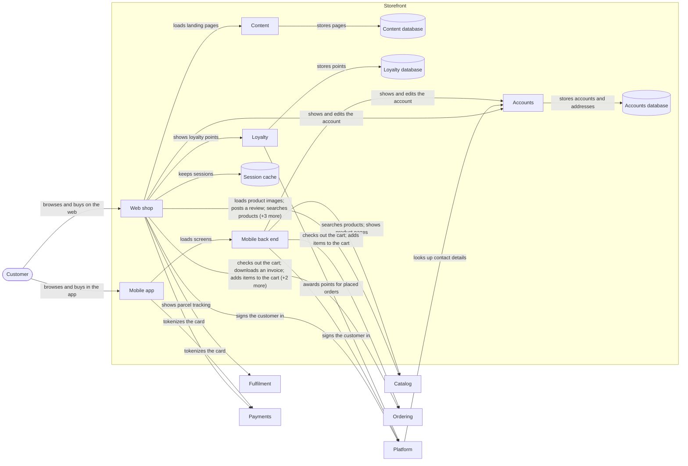

# Storefront (domain)

```mermaid
flowchart LR
  subgraph storefront ["Storefront"]
    accounts_api["Accounts"]
    accounts_db[("Accounts database")]
    content_api["Content"]
    content_db[("Content database")]
    loyalty_api["Loyalty"]
    loyalty_db[("Loyalty database")]
    mobile_app["Mobile app"]
    mobile_bff["Mobile back end"]
    session_cache[("Session cache")]
    web_shop["Web shop"]
  end
  catalog["Catalog"]
  customer(["Customer"])
  fulfilment["Fulfilment"]
  ordering["Ordering"]
  payments["Payments"]
  platform["Platform"]
  accounts_api -->|"stores accounts and addresses"| accounts_db
  content_api -->|"stores pages"| content_db
  customer -->|"browses and buys in the app"| mobile_app
  customer -->|"browses and buys on the web"| web_shop
  loyalty_api -->|"stores points"| loyalty_db
  loyalty_api -->|"awards points for placed orders"| platform
  mobile_app -->|"loads screens"| mobile_bff
  mobile_app -->|"tokenizes the card"| payments
  mobile_bff -->|"shows and edits the account"| accounts_api
  mobile_bff -->|"searches products; shows product pages"| catalog
  mobile_bff -->|"checks out the cart; adds items to the cart"| ordering
  mobile_bff -->|"signs the customer in"| platform
  platform -->|"looks up contact details"| accounts_api
  web_shop -->|"shows and edits the account"| accounts_api
  web_shop -->|"loads product images; posts a review; searches products (+3 more)"| catalog
  web_shop -->|"loads landing pages"| content_api
  web_shop -->|"shows parcel tracking"| fulfilment
  web_shop -->|"shows loyalty points"| loyalty_api
  web_shop -->|"checks out the cart; downloads an invoice; adds items to the cart (+2 more)"| ordering
  web_shop -->|"tokenizes the card"| payments
  web_shop -->|"signs the customer in"| platform
  web_shop -->|"keeps sessions"| session_cache
```

Up: [Landscape](_landscape.md)

Open: [Catalog](catalog.md) · [Fulfilment](fulfilment.md) · [Ordering](ordering.md) · [Payments](payments.md) · [Platform](platform.md)
