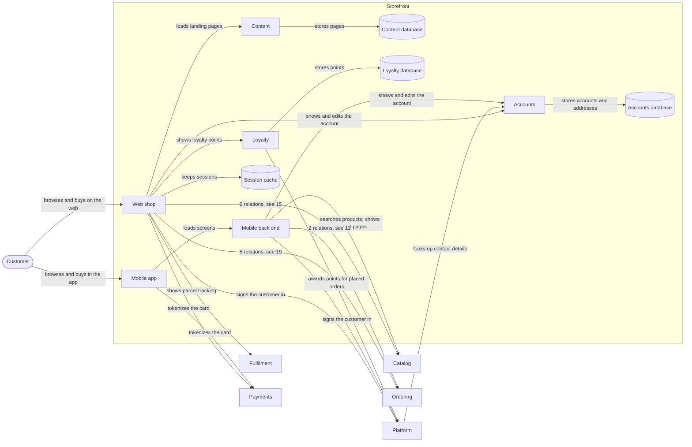

# Storefront (domain)

| # | From | To | Relations |
| --- | --- | --- | --- |
| 1 | Accounts | Accounts database | stores accounts and addresses |
| 2 | Content | Content database | stores pages |
| 3 | Customer | Mobile app | browses and buys in the app |
| 4 | Customer | Web shop | browses and buys on the web |
| 5 | Loyalty | Loyalty database | stores points |
| 6 | Loyalty | Platform | awards points for placed orders |
| 7 | Mobile app | Mobile back end | loads screens |
| 8 | Mobile app | Payments | tokenizes the card |
| 9 | Mobile back end | Accounts | shows and edits the account |
| 10 | Mobile back end | Catalog | searches products; shows product pages |
| 11 | Mobile back end | Ordering | checks out the cart; adds items to the cart |
| 12 | Mobile back end | Platform | signs the customer in |
| 13 | Platform | Accounts | looks up contact details |
| 14 | Web shop | Accounts | shows and edits the account |
| 15 | Web shop | Catalog | loads product images; posts a review; searches products; shows product pages; shows recommendations; shows reviews |
| 16 | Web shop | Content | loads landing pages |
| 17 | Web shop | Fulfilment | shows parcel tracking |
| 18 | Web shop | Loyalty | shows loyalty points |
| 19 | Web shop | Ordering | checks out the cart; downloads an invoice; adds items to the cart; requests a return; shows the order history |
| 20 | Web shop | Payments | tokenizes the card |
| 21 | Web shop | Platform | signs the customer in |
| 22 | Web shop | Session cache | keeps sessions |

Up: [Landscape](_landscape.md)

Open: [Catalog](catalog.md) · [Fulfilment](fulfilment.md) · [Ordering](ordering.md) · [Payments](payments.md) · [Platform](platform.md)
