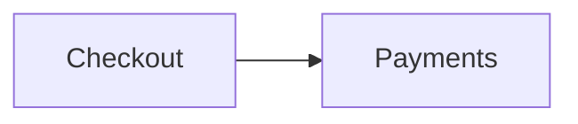

# Architecture

The checkout service talks to payments over gRPC; the decision to use it is
written down in [the decision record](decisions/0001-use-grpc.md).

The flow, drawn here and rendered by the wiki like any diagram tab:

Characters that are markup elsewhere stay literal prose here: a map written
{a, b} and a type written <T> must both survive the wiki's builders.

Back to [the README](../README.md#documents-fixture), at its own heading.
