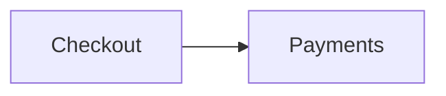

# Architecture

The checkout service talks to payments over gRPC; the decision to use it is
written down in [the decision record](decisions/0001-use-grpc.md).

The flow, drawn here and rendered by the wiki like any diagram tab:

Characters that are markup elsewhere stay literal prose here: a map written
{a, b} and a type written <T> must both survive the wiki's builders. So must
markup a repository has no business running in a reader's browser:
 and  are shown,
never run.

A link a repository has no business making — [run this](javascript:alert(document.domain)) —
is shown as text: the build warns about it and keeps only http, https and
mailto links.

A bare address is a link again: <https://example.com/scheme-probe>. Neither
is <javascript:alert(document.domain)> one — it stays text.

Back to [the README](../README.md#documents-fixture), at its own heading.
